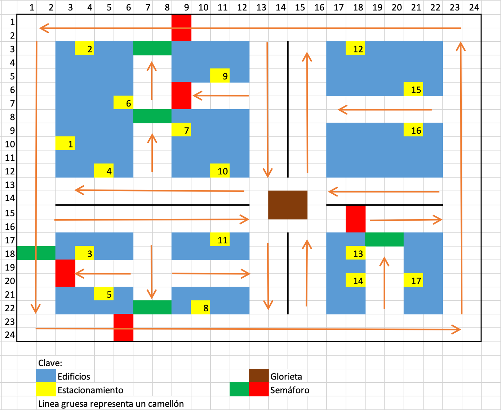

Actividad Integradora 1 - Sistemas Multiagente
========================

El objetvo del reto es que al menos un auto salga de un estacionamiento y llegue a otro.

Para el resto del reto, utilizando el siguiente mapa para una ciudad.



Los estacionamientos se encuentran numerados para poder identificar claramente en cuál estacionamiento tiene que llegar o salir un automovil.

La visualización se ejecuta hasta que los autos (auto) hayan llegado a su destino.

## Índice

1. [Instrucciones de Simulación](#instrucciones-de-simulación)
2. [Descargar y Ejecutar el Proyecto](#descargar-y-ejecutar-el-proyecto)

## Instrucciones de Simulación:

Durante la simulación, se observará lo siguiente:

- El modelo de agentes incluye todos los agentes y objetos necesarios.
- El visualizador permite ver toda la simulación en tiempo real.
- Para cada auto, se puede indicar de manera sencilla el número de estacionamiento del que sale y al que llega.
- Los autos:
    - Evaden obstáculos y no colisionan.
    - Respetan los semáforos.
    - Salen y entran en el lugar indicado.
- Los semáforos cambian de color de manera adecuada.

Estas características aseguran una simulación completa y funcional del sistema multiagente.

## Descargar y Ejecutar el Proyecto:

Para descargar y ejecutar el proyecto, sigue estos pasos:

1. Clona el repositorio:
    ```sh
    git clone https://github.com/Dino-Julius/Reto-TC2008B.301.E6-SMA.git
    ```

2. Navega al directorio del proyecto:
    ```sh
    cd Reto-TC2008B.301.E6-SMA
    cd Actividad-Integradora-1
    cd SMA
    ```

3. Instala las dependencias:
    ```sh
    pip install .
    ```

4. Ejecuta la simulación:
    ```sh
    python run.py
    ```

Esto iniciará el servidor y podrás visualizar la simulación en tu navegador web.