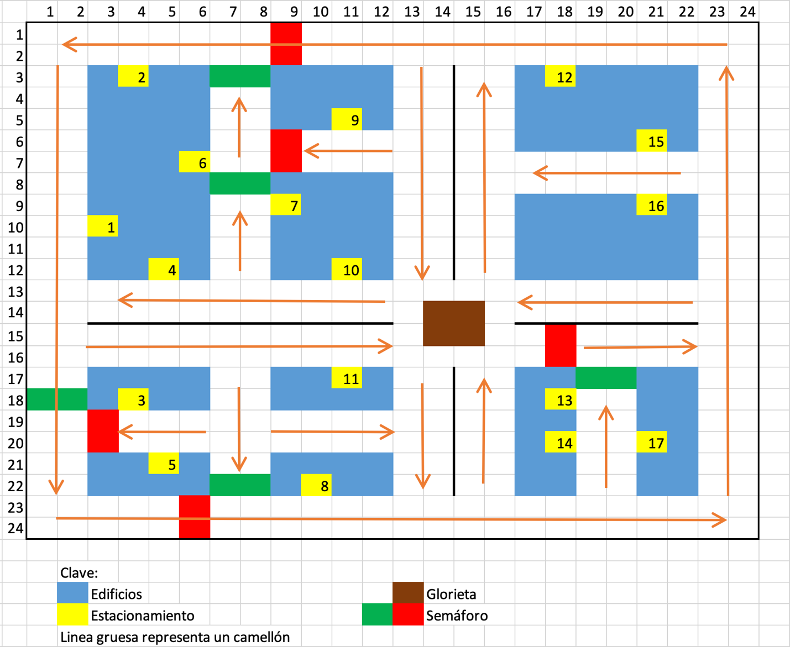

SMA en MESA: Modelo de Movilidad Urbana
========================

El modelo de movilidad urbana es un sistema multiagente (SMA) que simula el tráfico de automóviles en una ciudad. La ciudad cuenta con una red de calles, semáforos y estacionamientos. Los autos navegan por la ciudad de manera inteligente, evitando obstáculos y respetando los semáforos.



Los estacionamientos se encuentran numerados para poder identificar claramente en cuál estacionamiento tiene que llegar o salir un automovil.

La simulación se encuentra en modo *endless*, lo que significa que la simulación no tiene un fin, cuando todos los vehiculos llegan a su destino, eligen nuevos destinos para continuar la navegación por la ciudad. Los peatones se mueven de manera aleatoria por la ciudad, solamente en espacios seguros y cruzando por los pasos peatonales inteligentemente.

## Índice

1. [Estructura del Proyecto](#estructura-del-proyecto)
2. [Instrucciones de Simulación](#instrucciones-de-simulación)
3. [Descargar el proyecto](#descargar-el-proyecto)

## Estructura del Proyecto

```bash
SMA/                                    # Carpeta principal del proyecto
├── assets/                             # Carpeta que contiene los recursos necesarios para la simulación
├── model/                              # Carpeta que contiene el modelo de agentes
├── tests/                              # Carpeta que contiene las pruebas del modelo de agentes
├── app.py                              # Script para ejecutar el servidor 
├── README.md                           # Este documento
├── run.py                              # Script para ejecutar la simulación
└── setup.py                            # Script de configuración de la simulación
```

## Instrucciones de Simulación:

Durante la simulación, se observará lo siguiente:

- El modelo de agentes incluye todos los agentes y objetos necesarios.
- El visualizador permite ver toda la simulación en tiempo real.
- Para cada auto, se puede indicar de manera sencilla el número de estacionamiento del que sale y al que llega.
- Los autos:
    - Navegan inteligentemente por la ciudad.
    - Evaden obstáculos y no colisionan.
    - Respetan los semáforos.
    - Comienzan en un estacionamiento inicial y llegan a otro estacionamiento.
- Los semáforos cambian de color de manera adecuada e inteligente.
    - Los semáforos cambian de color por tiempo y por la cantidad de autos en la intersección.
    - Los semáforos cambian de color dependiendo de la cantidad de autos que se encuentran en la intersección, donde se realiza una negociación entre el semaforo más cercano y el que comienza dicha negociación.
- Los peatones se mueven de manera aleatoria por la ciudad, solamente en espacios seguros y cruzando por los pasos peatonales inteligentemente.
- Desde el visualziador web se puede avanzar, pausar, reiniciar y modificar los parámetros de la simulación.

Estas características aseguran una simulación completa y funcional del sistema multiagente.

## Descargar el proyecto

Para descargar y ejecutar el proyecto, sigue estos pasos:

1. Clona el repositorio:
    ```sh
    git clone https://github.com/Dino-Julius/Reto-TC2008B.301.E6-SMA.git
    ```

2. Navega al directorio del proyecto:
    ```sh
    cd Reto-TC2008B.301.E6-SMA
    cd SMA
    ```

3. Instala las dependencias:
    ```sh
    pip install .
    ```

### Ejecutar modelo con interfaz gráfica en el navegador web:

4. Para ejecutar la simulación, ejecuta el siguiente comando en la terminal:
    ```sh
    python run.py
    ```

5. Desde el navegador se podrá visualizar la simulación en el navegador web. En la ruta:
    ```sh
    http://127.0.0.1:8521/
    ```

6. Desde la interfaz gráfica se puede avanzar, pausar, reiniciar y modificar los parámetros de la simulación.

7. Para detener la simulación, presiona `Ctrl + C` en la terminal.

### Ejecutar el servidor flask para usar el visualizador de Unity:

4. Para ejecutar el servidor, ejecuta el siguiente comando en la terminal:
    ```sh
    python app.py
    ```

5. Desde el navegador o una herramienta de API testing (como Postman o Insomnia), se podrá visualizar el JSON generado por el servidor. En la ruta:
    
    - Esta ruta genera un JSON con la información al momento de la inicialización de los agentes en la simulación.
        ```sh
        http://127.0.0.1:8585/start
        ```

    - Esta ruta genera un JSON con la información al momento de la actualización de los agentes en la simulación, ya que cada petición es un paso en la simulación.
        ```sh
        http://127.0.0.1:8585/update
        ```

6. Para detener el servidor, presiona `Ctrl + C` en la terminal.

> **Nota:** Es requisito que el servidor de flask esté en ejecución antes de ejecutar el visualizador en Unity, si el visualizador en Unity se reinicia, igual se debe reiniciar el servidor.